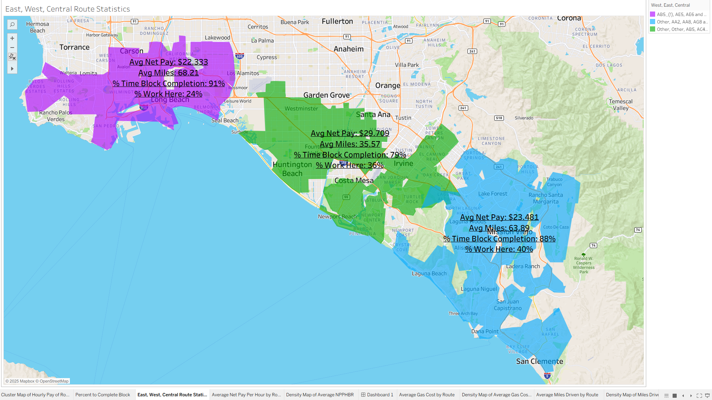
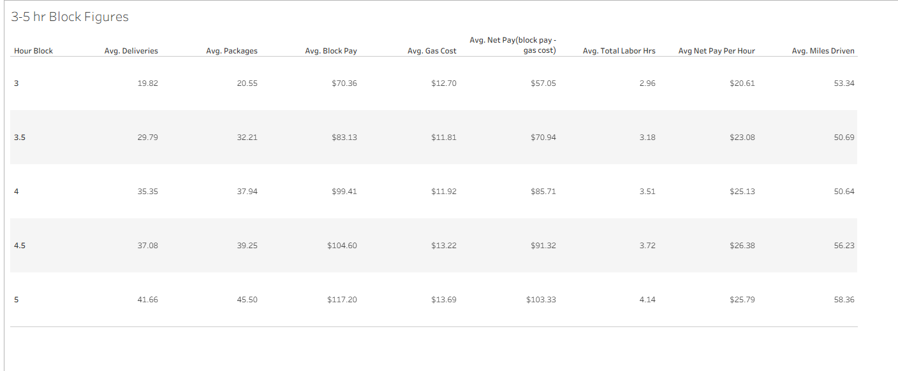

# Amazon Flex Driver Partner Experience: Profitability & Route Analysis

## Project Overview
The "Gig Economy" often obscures the true cost of doing business for independent contractors. This project aims to provide a transparent, data-driven **"Day in the Life"** insight into the Amazon Flex driver/partner experience.

By combining income data with precise GPS mileage and expense tracking, this analysis moves beyond top-line revenue to answer critical questions for current and potential drivers: *What should I actually expect working for Amazon Flex?* and *After gas what is the true hourly wage?*
#note: gas costs were estimated at ($4.20/gallon) and, while my vehicle is advertised as 30 mpg (combined), actual measured efficiency during routes was 19.6 mpg. Wear and tear on vehicle was not factored in. (please be sure to click on tableau links)

## Objectives
The primary goal was to dissect the economics of Amazon Flex routes (3hr, 3.5hr, 4hr, 4.5hr, and 5hr blocks) to give a realistic view of the daily workload. The analysis seeks to:
* **Visualize the "Day in the Life":** Map actual routes to show where drivers go and what are the accompanying figures (block pays, duration, gas costs, miles driven, frequency/probability of being sent west, east, or staying central to the warehouse.)
* **Determine True Earnings:** Calculate **Net Pay per Hour** after accounting for fuel costs.
* **Analyze Patterns:** Analyze figures in all delivery areas, and then create line/bar/summary tables.
* **Correlate Effort vs. Reward:** Ultimately Compare **Net Profit** against **Route Figures**.

## 🛠 Tools & Technologies
* **Data Cleaning & Analysis:** Microsoft Excel
* **Visualization & Dashboarding:** Tableau (2 distinct workbooks)
* **Geospatial Mapping:** GeoJSON.io (JSON code generation for map layers)
* **Data Collection:** Amazon Flex App, Everlance (GPS Mileage), Photo Metadata

## 📊 Data Source
This dataset is original, primary data collected personally over a 9-month period:
1.  **Amazon Flex App:** Source for shift blocks, gross pay, and official start/end times.
2.  **Everlance:** GPS-based logs used to track exact mileage for every route.
3.  **Delivery Metadata:** Geolocation and timestamps extracted from proof-of-delivery photos.

## 🔍 Methodology
1.  **Data Collection:** Aggregated shift data and matched it with corresponding GPS logs from Everlance.
2.  **Data Cleaning (Excel):** Standardized date formats, calculated gas costs based on daily average fuel prices, calculated total labor hours from start times and end times, and derived "Net Pay" metrics.
3.  **Geospatial Processing:** Used **Geojson.io** to convert raw location data into JSON format, allowing for precise route mapping and heatmaps of delivery zones.
4.  **Visualization (Tableau):** Created interactive dashboards to visualize cost breakdowns and route efficiency.

---

## 🌍 Visualizations & Dashboards
I have created two distinct dashboards to analyze different aspects of the delivery process. Click the links below to interact with the live data.

### 1. Geospatial Route Analysis
*This dashboard visualizes the physical delivery routes, comparing mileage, cluster density, costs, labor hours, net pays, and work coverage.

**[👉 Click here to view Route Maps on Tableau Public](https://public.tableau.com/views/FirstHalfofAmazonDeliveryPartnerProject/DensityMapofMilesDrivenbyRoute?:language=en-US&:sid=&:redirect=auth&:display_count=n&:origin=viz_share_link)**

---

### 2. Formal Key Work Figures Sheets
*This dashboard breaks down the economics/key figures of the job.*

**[👉 Click here to view Figures Sheets on Tableau Public](https://public.tableau.com/views/SecondHalfofAmazonDeliveryPartnerProject/Chart?:language=en-US&:sid=&:redirect=auth&:display_count=n&:origin=viz_share_link)**

---

## 📂 Project Files
* `routes.geojson`: The geospatial data file used to generate the map layers.
* *(Note: The raw Excel data is not included).*
