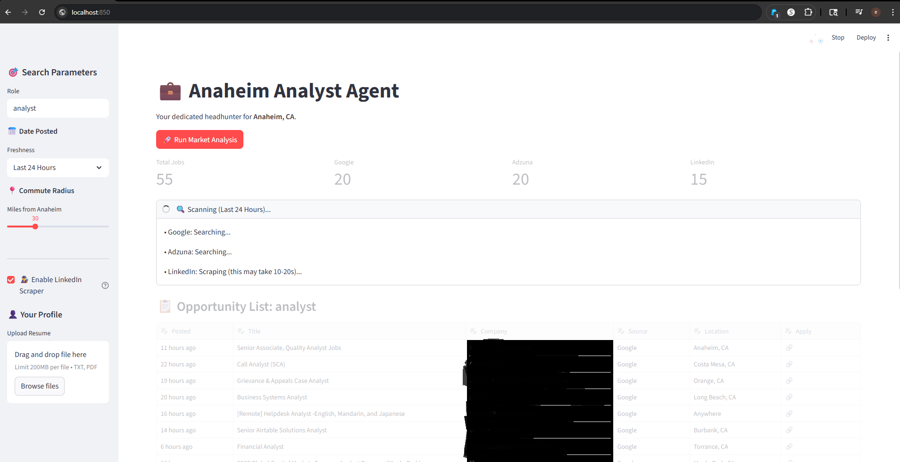

#building an automated pipeline to aggregate and score real time job market data
#fancy shmancy building a tool to feed me data analysis jobs instead of using a lot of time looking across the web 

# 🚀 AI Analyst HQ: Automated Job Market Aggregator

**A Python-based data pipeline that automates the daily job search workflow.**

*(Current Work in Progress UI)*

## 📖 The Business Problem
Finding a job is essentially a data retrieval problem, but the current process is manually inefficient. People (myself included) have to scour the web for multiple job listing sources (LinkedIn, Indeed, Google Jobs), resetting the same filters ("Anaheim", "20 miles"), and manually cleaning noisy results.

## 💡 The Solution
I built **AI Analyst HQ** to treat the job market as a dataset. Instead of browsing, I built a centralized **ETL (Extract, Transform, Load)** pipeline that:
1.  **Extracts** real-time listings from multiple aggregators (Google Jobs, Adzuna, LinkedIn).
2.  **Transforms** disparate JSON structures into a unified, clean Pandas DataFrame.
3.  **Loads** high-relevance roles into a dashboard with **direct "Quick Apply" links**, allowing me to jump from analysis to application instantly.

> **Impact:** Reduces daily market research time from **hours to <30 seconds**.

---

## 🏗️ Data Architecture (The Pipeline)

### 1. Meta-Aggregation (The "Scraper of Scrapers")
To ensure maximum coverage without managing 5+ separate accounts, the backend leverages a meta-aggregation strategy:
* **Google Jobs Engine (via SerpApi):** Aggregates listings from Indeed, LinkedIn, ZipRecruiter, and Glassdoor.
* **Adzuna API:** Provides programmatic access to additional job feeds.
* **JobSpy (Python Library):** A direct scraping utility used as a redundant data layer to cross-reference and capture listings from LinkedIn and Indeed that might be missed by standard aggregators.
* **Technical Challenge Solved:** Implemented custom pagination logic to handle Google's token-based infinite scroll (`next_page_token`), allowing deep data retrieval beyond the standard API limits.

### 2. Geospatial Logic & Normalization
* **Location Parsing:** The pipeline dynamically standardizes location strings (e.g., converting "Anaheim, CA" to strict entity strings like `"Anaheim, California, United States"`) to prevent "Zero Result" errors from strict API endpoints.
* **Radius Filtering:** Automatically converts user-defined mile radiuses into kilometers for API compatibility, ensuring precise commute filtering.

---

## 🚧 Current Development: The "AI Agent" Phase
*Status: In Active Implementation*

With the data pipeline now stable, I am currently integrating **Google Gemini 2.5 Flash** to transform this tool from a "Aggregator" into an autonomous "Agent."  In layman's term I can have an AI agent that reports back compatibility or "work fit" of work roles.  This way I do less thinking and can focus on other things.

**The Goal:**
Instead of me reading the job descriptions, the Agent will:
* **Ingest** the raw text descriptions from the dataframe.
* **Compare** them against my personal job finder metrics and resume.
* **Output** a "Match Score" and "Skill Gap Analysis" automatically.

---

## 🛠️ Tech Stack

* **Core Logic:** Python 3.9+
* **Frontend:** Streamlit
* **Data Processing:** Pandas (Dataframes & JSON Normalization)
* **APIs:** SerpApi (Google), Adzuna (Requests)
* **AI (In Progress):** Google GenAI SDK

*Building data solutions to solve real-world inefficiencies.*
