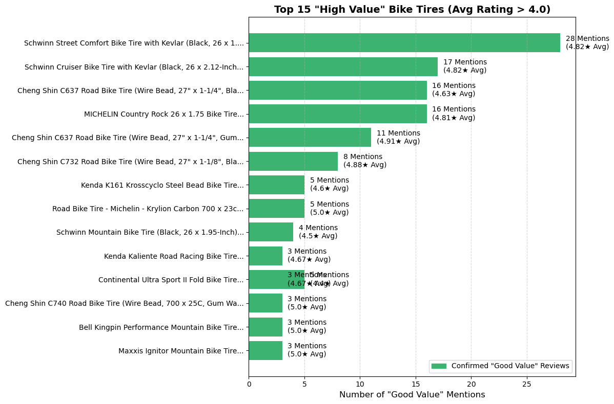
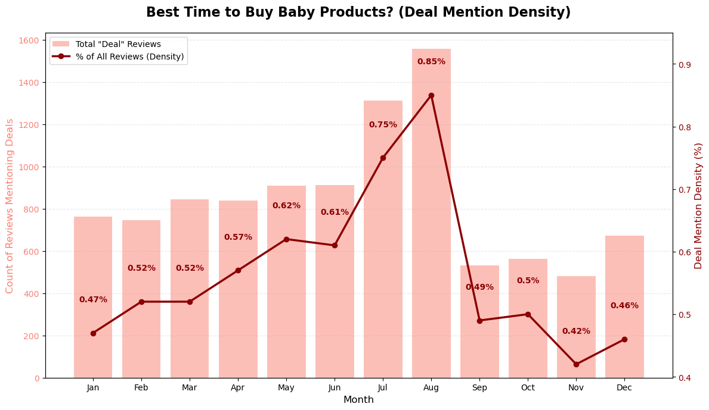
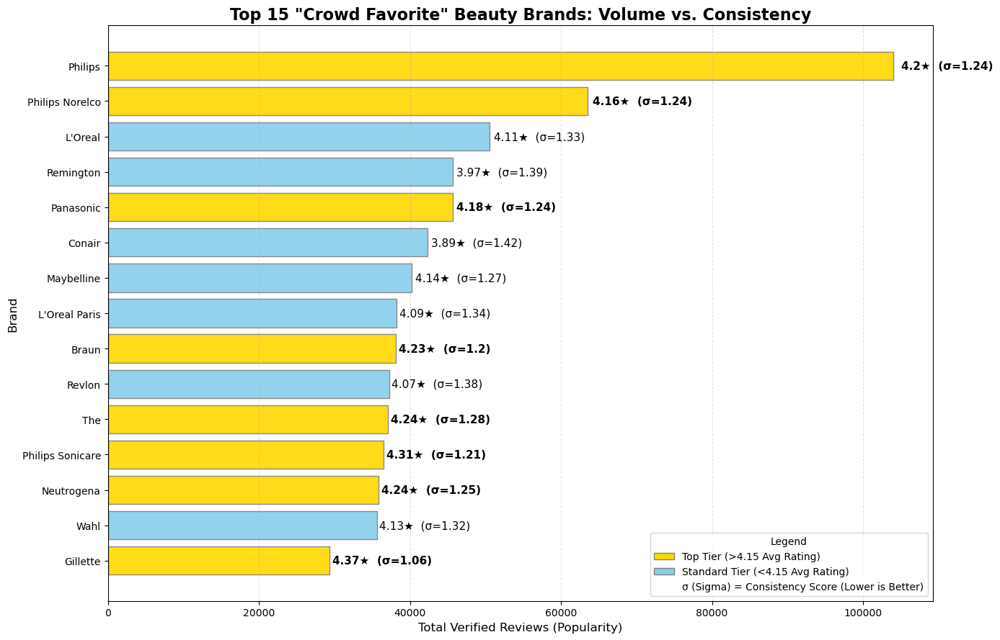
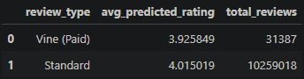
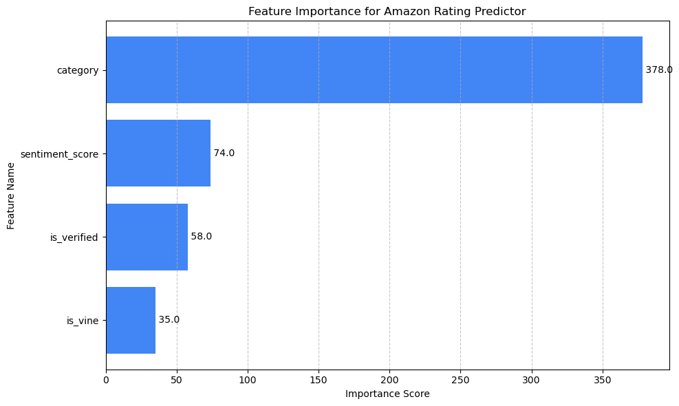
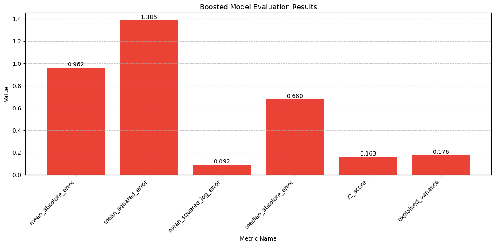
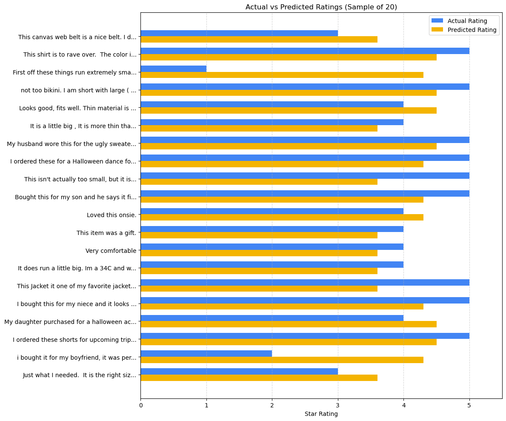

# Amazon Big Data Challenge: My First Machine Learning Project

## 📌 Project Overview
This project represents a personal milestone: **My first attempt at building a Machine Learning model completely within a Cloud Data Warehouse.**

To challenge myself technically, I ingested the massive "Amazon US Customer Reviews" dataset (~54GB, 37 categories) into **Google BigQuery**. This dataset contains over two decades of user feedback, spanning from **June 1995 to August 2015**.  While the data itself is over 10 years old, it still possesses insights into hypothetical questions for that timeline. My goal was not just to analyze the data, but to engineer a full pipeline—from answering ad-hoc "stakeholder" questions to training a Boosted Tree Regressor using only SQL.

## 🎯 Objectives
* **Handle Big Data:** Work with a dataset (54GB) too large for standard local memory, utilizing cloud infrastructure.
* **Simulate Stakeholder Requests:** Interview family members to gather "business questions" and translate them into SQL queries.
* **Build an ML Model:** Create, train, and evaluate a regression model directly inside BigQuery (BQML) to predict product ratings.

---

## 🗣️ Part 1: The "Stakeholder" Analysis
To simulate a real-world business environment, I treated my family members as stakeholders. I interviewed them about their current shopping needs and translated their "natural language" questions into precise SQL queries.

### 🚲 Stakeholder 1: The Father (Value Analysis)
* **The Request:** *"I need new tires for my bike. I don't want to buy 'cheap junk,' but I don't want to overpay. Where is the sweet spot?"*
* **SQL Strategy:**
    * **Precision Filtering:** Used `REGEXP_CONTAINS` to isolate "Bike Tire" while excluding 30+ accessory keywords (e.g., *tubes, caps, repair kits*).
    * **Value Hunting:** Searched the `review_body` for semantic value signals using the regex pattern: `r'(?i)good value|great price|bang for the buck'`.
    * **Ranking:** Ranked products by the volume of these "value-confirming" reviews rather than raw star rating alone.
* **Key Finding:** The **Schwinn Street Comfort Tire** was the clear winner, with the highest volume of verified "value" mentions (28) while maintaining a high 4.82★ rating.



### 👶 Stakeholder 2: The Sister (Seasonality & Trends)
* **The Request:** *"I buy a lot of baby clothes. Is there a specific time of year where prices/activity seem to drop?"*
* **SQL Strategy:**
    * **Temporal Aggregation:** Used `EXTRACT(MONTH FROM review_date)` on the `Baby` category to aggregate millions of rows into annual trends.
    * **Noise Reduction:** Filtered specifically for `verified_purchase = true` to remove bot traffic and identify genuine seasonal purchasing spikes.
    * **Sentiment Mining:** Instead of just tracking volume, I calculated "Deal Density." I used SQL Regex to count how often reviews contained keywords like *sale, discount, price drop, or markdown* relative to the total number of reviews for that month.
    * **Validation:** Plotted this "Deal Percentage" over a 12-month cycle to find statistically significant spikes in value-related discussion.
* **Key Finding:** **August** is the clear winner for deals (likely correlating with End-of-Summer/Back-to-School sales), with the highest density (0.86%) of reviews mentioning discounts. July was 2nd followed by May and June. Recommended buying season for baby clothes points towards summer.



### 💄 Stakeholder 3: The Partner (Product Discovery)
* **The Request:** *"I want to try new makeup/beauty products, but I'm overwhelmed by the options. What are the safest 'sure bets' to try?"*
* **SQL Strategy:**
    * **Brand Extraction:** Used `REGEXP_EXTRACT` to parse the first 1-3 words of product titles, grouping millions of products into recognizable brand entities (e.g., "Philips," "L'Oreal Paris").
    * **Risk Analysis:** Calculated the Standard Deviation (`STDDEV`) of ratings. A high average rating with a *low* standard deviation indicates a "safe bet" (consistent quality), whereas high variance implies a "hit-or-miss" product.
* **Key Finding:** **Philips** and **Braun** emerged as the "Safest Bets," boasting high review volumes and ratings >4.2 with low variance, making them statistically reliable purchases.  Beauty is very subjective so the top 15 results/brands are listed.



---
## 🧠 Part 2: My First Machine Learning Model
For the second phase of this project, I challenged myself to move beyond descriptive analysis and build a predictive model. I wanted to answer: *Can we predict a product's star rating based solely on the text of the review?*

**The Data Engineering Challenge:**
Before building the model, I had to unify the dataset. I used a massive `UNION ALL` query to stitch together **37 separate category tables** (Wireless, Apparel, Automotive, etc.) into a single master dataset, enabling the model to learn from patterns across the entire Amazon ecosystem.

* **Model Type:** Boosted Tree Regressor (BigQuery ML)
* **Target:** `star_rating` (1-5)
* **Training Data:** 70% Split | **Evaluation Data:** 30% Split

### 🛠 Feature Engineering 
Since raw text cannot be fed directly into a regression model, I had to get creative. I used SQL `REGEXP` functions to engineer a custom **"Sentiment Score"** feature, essentially converting feelings into math.

```sql
-- My Custom Sentiment Formula
(
  -- Count positive words (love, great, excellent...)
  IFNULL(ARRAY_LENGTH(REGEXP_EXTRACT_ALL(LOWER(review_body), r'love|great|excellent|amazing...')), 0)
  - 
  -- Subtract negative words (hate, worst, terrible, bad...)
  IFNULL(ARRAY_LENGTH(REGEXP_EXTRACT_ALL(LOWER(review_body), r'hate|worst|terrible|bad...')), 0)
) as sentiment_score
```

### 📊 Key Learnings & Results
As this was my first ML project, the results provided a lesson in the difference between "textbook" data and "real world" human behavior.  I also learned a lot and want to build upon.

**1. The "Vine Voice" Surprise**
My model found that **Vine (Paid) Reviewers** actually predicted *lower* ratings (3.92) than standard customers (4.01). This contradicts the common myth that paid reviewers always leave inflated 5-star feedback to please sellers.


**2. Feature Importance**
The product's **Category** was by far the strongest predictor (Importance: 378), followed by my custom **Sentiment Score** (74). This suggests that *what* you are buying (e.g., a book vs. a vacuum) determines the baseline rating more than the specific words used in a single review.


**3. Model Performance (A Lesson in "Real World" Noise)**
* **R² Score:** 0.163
* **Retrospective:** While the R² is low (explaining ~16% of the variance), this was a valuable learning experience. It highlights that human sentiment is complex—sarcasm, nuance, and product expectations (e.g., "It's okay for the price") are difficult to capture with simple keyword counting.


### 📈 Visualizations
*Comparing the model's predicted ratings (Yellow) vs. Actual ratings (Blue) for a random sample of 20 reviews.*


---

## 🚀 Future Improvements
While this project established a functional ML pipeline in the cloud, the R² score (0.163) indicates that star ratings are driven by more than just keyword counts. To improve model performance in V2, I would:
* **Upgrade NLP:** Move beyond simple "Bag of Words" (Regex) to **Text Embeddings** (using a pre-trained model like BERT or TensorFlow Hub) to capture context, sarcasm, and nuance.
* **Expand Features:** Incorporate "Reviewer History" (do they always give 1 star?) and "Price Point" to see if expectations scale with cost. I have 'customer_id' in the data I used.

## 🛠️ Tech Stack & Tools
* **Cloud Data Warehouse:** Google BigQuery
* **Machine Learning:** BigQuery ML (Boosted Tree Regressor)
* **Query Language:** Standard SQL (Common Table Expressions, Regex, Window Functions)
* **Visualization:** Python (Matplotlib, Pandas) inside a Docker Container
* **Data Source:** Amazon US Customer Reviews (Kaggle - 54GB)/ source: https://www.kaggle.com/datasets/cynthiarempel/amazon-us-customer-reviews-dataset

---
