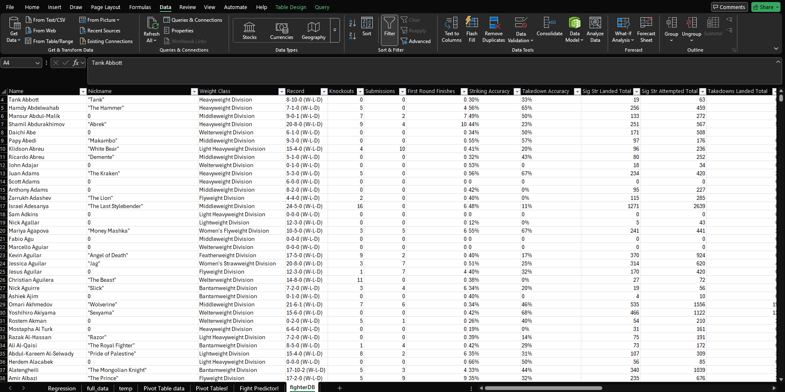

# UFC Fight Predictor & Automated Data Pipeline

## 🥊 Project Overview
This project combines **Data Engineering** and **Sports Analytics** to create a living, breathing UFC fight predictor.

Unlike static analysis projects that use stale CSVs, I built an **automated end-to-end pipeline**. A Python script scrapes fresh fighter statistics every Sunday morning (post-fight night), stores them in the cloud, and feeds them into a custom Excel/Regression-based fight outcome model that predicts hypothetical fight outcomes.

## 🏗️ The Architecture
I designed a "Hybrid Cloud/Local" architecture to ensure the data is always fresh without needing complex database infrastructure for the end-user.


* **Source:** `UFC.com` Athlete Database
* **Ingestion:** Python (`BeautifulSoup`, `Requests`) running in a Docker container.
* **Storage:** Google Cloud Storage (Bucket: `ufc-data-fifth-handbook`).
* **Transformation:** Local "Fetcher" script cleans nulls (replacing `N/A` with `0` for regression compatibility) and formats data.
* **Presentation:** Dynamic Excel Dashboard with VBA & Regression models.

---

## 🤖 Part 1: The Automated Data Pipeline
To ensure my model always uses the latest stats (e.g., updating a fighter's record after a Saturday night fight), I automated the data collection process.

### 1. The Scraper (Google Cloud Run)
I wrote a Python script to scrape the official UFC athlete roster. This job is containerized and scheduled via **Google Cloud Run** to execute every Sunday.

**Key Libraries Used:**
```python
import requests
from bs4 import BeautifulSoup
import pandas as pd
from tqdm import tqdm

first_url = '[https://www.ufc.com/athletes/all?gender=All&search=&page=](https://www.ufc.com/athletes/all?gender=All&search=&page=)'
```

**Automation Evidence:**
*The `ufc-scraper-job` successfully executing the Sunday morning data fetch.*


### 2. The Fetcher (Local Integration)
I created a local Python utility (`fetcher.py`) that acts as the bridge between the Cloud and Excel. It connects to the `ufc-data-fifth-handbook` bucket, downloads the raw data, and sanitizes it for the model.

* **Data Cleaning Logic:** The regression model requires strict numeric inputs. The fetcher identifies `N/A` or `null` values (common for debut fighters) and replaces them with `0` to prevent calculation errors.

**Data Transformation (Before vs. After):**
*Raw data from cloud (Left) vs. Cleaned data for Regression (Right)*
<p float="left">
  
   
</p>

```python
import pandas as pd
from google.cloud import storage
import os

# --- CONFIGURATION ---
BUCKET_NAME = "ufc-data-fifth-handbook"
LOCAL_FILENAME = "fighterDB.csv" 

def fetch_and_clean_data():
    print("Connecting to Google Cloud...")
    # ... (Download and cleaning logic)
```

## 📊 Part 2: The Fight Predictor (Excel & Regression)
The core of the analysis happens in a Excel workbook that connects to the live `fighterDB.csv` generated by the fetcher.

### The Regression Model
I built a **Regression-based fight outcome model** using historical fight data spanning **1996 to 2024**. I applied strict data cleaning to ensure the model wasn't influenced by early-era fights with missing metrics.

* **Initial Dataset:** 7,439 rows / 94 columns
* **Cleaned Training Set:** **5,579 fights** (Rows with complete data used for modeling)

**Statistical Validation:**
*I performed an ANOVA analysis to ensure the variables selected were statistically significant predictors of victory.*
* **R² Score:** 0.34 (Explaining ~34% of variance in outcomes, a strong signal for human sports data).


**Key Features Analyzed:**
* Significant Strikes Landed per Minute (SLPM)
* Striking Accuracy & Defense
* Takedown Average & Accuracy
* Reach Differential

### The Simulator Dashboard
I built a user-friendly "Face-Off" interface in Excel.

* **User Input:** Select "Red Corner" and "Blue Corner" fighters from a dropdown list.
* **Data Retrieval:** VLOOKUPs/XLOOKUPS pull the latest stats from the connected `fighterDB`.
* **The Prediction:** The model applies the regression weights to the two fighters' stats to generate a **Win Probability Percentage**.

**Example Output:**
* Justin Gaethje (Red)* vs. *Paddy Pimblett(Blue)* an upcoming fight on January 24, 2026
* **Model Prediction:** Paddy Pimblett wins (**81.13%** Probability) 


---

## 🚀 Future Improvements
* **Full Cloud Migration:** Automate the 'fetcher' task
* **Betting Odds Integration:** For fun scrape live betting odds to compare my model's probability against Vegas betting odds

## 🛠️ Tech Stack


* **Python:** BeautifulSoup4, Pandas, Google-Cloud-Storage, Tqdm
* **Cloud:** Google Cloud Platform (Cloud Storage, Cloud Run/Scheduler)
* **Excel:** Advanced Formulas, Pivot Tables, Linear Regression
* **Data Engineering:** Cron Scheduling, ETL Pipeline construction
* **Data Source:** [UFC Complete Dataset (1996-2024) - Kaggle](https://www.kaggle.com/datasets/maksbasher/ufc-complete-dataset-all-events-1996-2024)  
